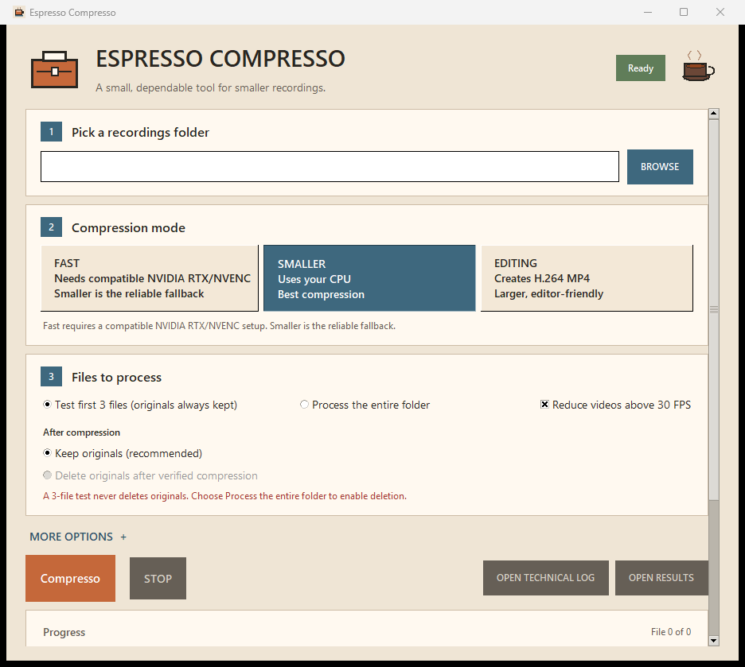

# Espresso Compresso

Espresso Compresso is a small, local app for compressing a folder of recordings.
It processes one file at a time so the computer stays usable.



## Windows download

[Download Espresso Compresso for Windows x64](https://github.com/EERON36/espresso-compresso/releases/latest/download/Espresso-Compresso-Windows-x64.zip)

The repository must be accessible to you if the release is private.

1. Download the ZIP and use **Extract All**.
2. Open the extracted folder and double-click **Espresso Compresso**.
3. Choose a recordings folder, keep **Smaller** selected, and begin with the three-file test.

Originals are kept by default. Results go to `_compressed` unless you choose a
different output folder. Windows may show a SmartScreen message for a new
download; continue only when you trust the official release page.

### Windows security warning

This private build is not code-signed, so Windows may describe it as an
unrecognized or suspicious app. This is a reputation warning; it does not mean
Windows detected malware.

If you downloaded it from the release link above, choose **More info**, check
that the app is **Espresso Compresso.exe**, then choose **Run anyway**. Do not
disable SmartScreen globally. If **Run anyway** is unavailable, Windows policy
is blocking unsigned apps and this build cannot be opened safely on that PC.

**Fast** requires compatible NVIDIA RTX/NVENC hardware and drivers. If it is
unavailable or fails, choose **Smaller**, the reliable fallback.

## Safety

- A completed output is written to a unique temporary name, validated, then moved
  into place. Interrupted temporary files are retained for inspection.
- Restarting recognizes a valid existing output, but never deletes an original
  because of it.
- Deletion requires a newly encoded, smaller output in the current run, strict
  media validation, a source recheck, and a successful full video/audio decode by
  `ffmpeg`. Without `ffmpeg`, originals remain untouched.
- Stopping asks the active encode to end gracefully before using a forced stop.

## Source and Linux

The Windows ZIP includes its own runtime and media tools. Running from source
still requires Python 3.10+ with Tk and compatible local tools.

Windows source: double-click `Start Espresso Compresso.bat`, or drag a folder
onto it. Linux: run `sh start-espresso-compresso.sh /path/to/recordings`.

The command line remains available:

```powershell
python .\espresso_compresso_cli.py "D:\Recordings" --mode quality --limit 3
```

Use `python .\espresso_compresso_cli.py --help` for all options.

## Development

```powershell
python -m unittest discover -s tests -v
```

The tests create only temporary directories and never use real recordings.
